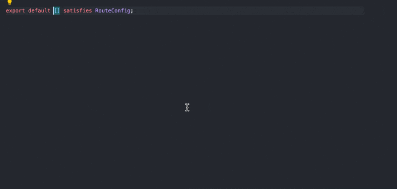
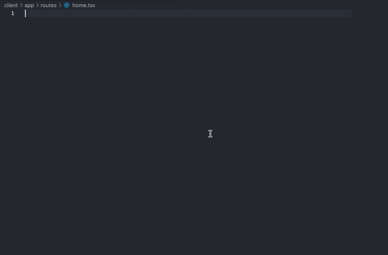

# VSCode React Router Snippets

Simple and Useful Snippets for [React Router v7](https://reactrouter.com/)

## Demo

| Configuring Routes                                   | Implement Page                                |
| ---------------------------------------------------- | --------------------------------------------- |
|  |  |

## Snippets

| From                                  | Snippet        | Renders                                           |
| ------------------------------------- | -------------- | ------------------------------------------------- |
| **R**ou**t**e                         | `rt`           | `route("pattern", "file"),`                       |
| **I**ndex **R**ou**t**e , **Ind**ex   | `irt` , `ind`  | `index("file"),`                                  |
| **N**ested **R**ou**t**e , **Nest**ed | `nrt` , `nest` | `route("parent", "file", [ ]),`                   |
| **L**ayout **R**ou**t**e , **Lay**out | `lrt` , `lay`  | `layout("file", [ ]),`                            |
| **P**refix **R**ou**t**e , **Pre**fix | `prt` , `pre`  | `...prefix("pattern", [ ]),`                      |
| **Imp**ort Route Type                 | `imp`          | `import type { Route } from "./+types/...";`      |
| **L**oa**d**er                        | `ld`           | `export async function loader({ ... }) { }`       |
| **C**lient **L**oa**d**er             | `cld`          | `export async function clientLoader({ ... }) { }` |
| **Ac**tion                            | `ac`           | `export async function action({ ... }) { }`       |
| **C**lient **Ac**tion                 | `cac`          | `export async function clientAction({ ... }) { }` |
| headers()                             | `headers`      | `export function headers() { return { }; }`       |
| Route handle                          | `handle`       | `export const handle = { };`                      |
| links()                               | `links`        | `export function links() { return [ ]; }`         |
| meta()                                | `meta`         | `export function meta() { return [ ]; }`          |
| **s**hould**R**e**v**alidate          | `srv`          | `export function shouldRevalidate(arg) { }`       |
| **R**oute **C**omponent               | `rc`           | `export default function Component() { }`         |
| **E**rror**B**oundary                 | `eb`           | `export function ErrorBoundary() { }`             |
| **H**ydrate**F**allback               | `hf`           | `export function HydrateFallback() { }`           |
